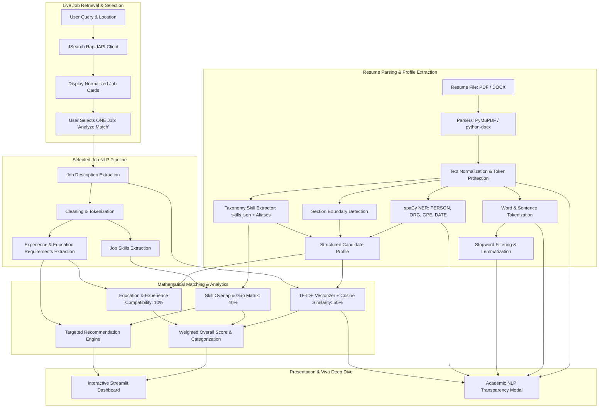

# NLP-Based Intelligent Resume Analysis and Job Matching System

An academic Natural Language Processing (NLP) system that parses candidate resumes (in PDF or DOCX format), extracts structured candidate profiles using classical NLP and Named Entity Recognition (NER), queries live job openings via the **RapidAPI JSearch API**, and performs transparent mathematical and linguistic comparison for a **single user-selected job**.

---

## 1. Problem Statement

Job seekers frequently struggle to gauge how closely their resumes align with complex, evolving job descriptions. Conversely, traditional applicant tracking filters often rely either on brittle, exact-string matching (which penalizes valid variations like *ML* vs. *Machine Learning*) or opaque, non-deterministic commercial Large Language Models (LLMs) that hallucinate scores and cannot explain their calculations.

This project addresses these challenges by implementing a **transparent, deterministic, academic NLP pipeline** that extracts candidate profiles, analyzes job requirements, and computes dynamic mathematical match analytics (TF-IDF Cosine Similarity, normalized skill matching, and requirement evaluation) without relying on closed LLM APIs.

---

## 2. Project Objective

The core objectives of this project are:
1. **Automated Candidate Extraction**: Ingest PDF and DOCX resumes and automatically extract contact information, technical skills, education credentials, experience timelines, and resume sections without requiring manual user input.
2. **Live Job Retrieval**: Query real-time job openings using the RapidAPI JSearch API across configurable roles, cities, and countries.
3. **Selective Analysis Principle**: Avoid computing wasteful scores across all retrieved jobs; only analyze the **single job** explicitly selected by the user.
4. **Authentic NLP Engine**: Implement genuine tokenization, stopword removal, WordNet/spaCy lemmatization, spaCy Named Entity Recognition (NER), TF-IDF vector space modeling, and Cosine Similarity.
5. **Multi-Factor Weighted Scoring**: Compute an overall match score using a configurable formula:
   $$\text{Overall Score} = (0.50 \times \text{TF-IDF}) + (0.40 \times \text{Skill Match}) + (0.10 \times \text{Requirements})$$
6. **Actionable Recommendations**: Generate personalized resume improvement recommendations derived strictly from detected skill gaps and missing qualifications.
7. **Viva & Evaluation Transparency**: Provide an interactive "How NLP Analyzed Your Resume" inspector allowing evaluators and faculty to verify every stage of the pipeline.

---

## 3. Architecture & Data Flow



---

## 4. NLP Techniques Used

| Pipeline Stage | Algorithm / Tool | Academic Purpose |
| :--- | :--- | :--- |
| **Document Parsing** | PyMuPDF (`pymupdf`), `python-docx` | Extracts raw layout-aware text from PDF blocks and DOCX tables/paragraphs. |
| **Token-Safe Cleaning** | Regex Lookbehinds & Boundaries | Protects special technical tokens (`C++`, `C#`, `.NET`, `Node.js`) while stripping non-printable characters. |
| **Tokenization** | NLTK `word_tokenize`, `sent_tokenize` | Splits continuous text into discrete grammatical tokens and sentence structures. |
| **Stopword Removal** | NLTK Stopwords Corpus | Filters non-informative words (`is`, `the`, `with`) while safeguarding short technical acronyms (`AI`, `ML`, `R`, `C`). |
| **Lemmatization** | WordNet Lemmatizer & spaCy Lemmatizer | Reduces inflected forms to dictionary root lemmas (`developing` $\to$ `develop`, `models` $\to$ `model`). |
| **Named Entity Recognition (NER)** | spaCy `en_core_web_sm` | Identifies `PERSON` (candidate name), `ORG` (employers/universities), `GPE` (locations), and `DATE` entities. |
| **Section Detection** | Heading Heuristics & Regex | Partitions resumes into `SUMMARY`, `EDUCATION`, `SKILLS`, `EXPERIENCE`, and `PROJECTS`. |
| **Skill Extraction & Normalization** | Word-Boundary Regex + Alias Dictionary | Identifies technical terms from `config/skills.json` and canonicalizes aliases (`ML` $\to$ `Machine Learning`, `sklearn` $\to$ `Scikit-learn`, `k8s` $\to$ `Kubernetes`). |
| **Vector Space Modeling** | Scikit-learn `TfidfVectorizer` | Computes Term Frequency-Inverse Document Frequency (TF-IDF) feature vectors with n-grams $(1, 2)$ and sublinear scaling. |
| **Similarity Measurement** | Scikit-learn `cosine_similarity` | Evaluates cosine angle between resume and job vectors: $\cos(\theta) = \frac{\mathbf{A} \cdot \mathbf{B}}{\|\mathbf{A}\|_2 \|\mathbf{B}\|_2}$. |
| **Scoring Formula** | Linear Multi-Factor Model | Dynamically calculates weighted composite score: $0.50 \times \text{TFIDF} + 0.40 \times \text{Skill} + 0.10 \times \text{Requirements}$. |

---

## 5. Distinction Between API and NLP System

It is crucial to understand the separation of concerns:
- **RapidAPI JSearch**: Responsible **strictly** for retrieving live job listings, company details, locations, and raw job descriptions. The API performs **no resume comparison or scoring**.
- **Internal NLP Engine**: Responsible for text extraction, candidate profile construction, job requirement parsing, TF-IDF vectorization, Cosine Similarity computation, skill gap analysis, and recommendation generation.

---

## 6. Project Structure

```text
Resume Analyzer/
├── .env                         # Local environment variables (API credentials, git-ignored)
├── .env.example                 # Sanitized template for environment variables
├── .gitignore                   # Excludes .env, cache, and virtual environments
├── app.py                       # Main Streamlit application entrypoint & routing
├── requirements.txt             # Python dependency specifications
├── README.md                    # Academic documentation & viva guide
│
├── config/
│   ├── __init__.py
│   ├── settings.py              # Application settings, scoring weights, API host
│   └── skills.json              # Curated skills taxonomy & canonical alias mappings
│
├── nlp/
│   ├── __init__.py
│   ├── preprocessing.py         # Text normalization & token-safe cleaning
│   ├── tokenizer.py             # Word & sentence tokenization
│   ├── lemmatizer.py            # Stopword filtering & WordNet lemmatization
│   ├── ner.py                   # spaCy Named Entity Recognition & Name extraction
│   ├── section_detector.py      # Resume section boundary identifier
│   ├── skill_extractor.py       # Regex boundary & alias-aware skill matcher
│   ├── similarity.py            # TF-IDF matrix & Cosine Similarity calculator
│   ├── resume_analyzer.py       # Full resume pipeline orchestrator & trace builder
│   └── job_analyzer.py          # Selected job description NLP analyzer
│
├── parsers/
│   ├── __init__.py
│   ├── pdf_parser.py            # PyMuPDF-based text extractor
│   └── docx_parser.py           # python-docx paragraph & table extractor
│
├── services/
│   ├── __init__.py
│   └── job_api.py               # RapidAPI JSearch client & response normalizer
│
├── scoring/
│   ├── __init__.py
│   ├── match_score.py           # Multi-factor weighted score calculation
│   └── recommendations.py       # Targeted gap-driven recommendation engine
│
├── ui/
│   ├── __init__.py
│   ├── styles.py                # Custom CSS design system
│   ├── resume_page.py           # Upload resume & candidate profile view
│   ├── jobs_page.py             # Live job search cards & selection
│   └── analysis_page.py         # Match analytics & viva inspection view
│
├── sample_data/
│   ├── sample_resume.txt        # Baseline ML Engineer resume
│   ├── sample_resume.pdf        # Test PDF resume
│   ├── sample_resume.docx       # Test DOCX resume
│   ├── sample_job.json          # Mock JSearch response payload
│   └── create_sample_files.py   # Test file generator
│
└── tests/
    ├── __init__.py
    ├── test_preprocessing.py    # Unit tests for text cleaning & tokenization
    ├── test_skill_extraction.py # Unit tests for skill extraction & aliases
    ├── test_similarity.py       # Unit tests for TF-IDF & Cosine Similarity
    ├── test_scoring.py          # Unit tests for weighted scoring formula
    └── test_job_api.py          # Unit tests for API normalization
```

---

## 7. Installation & Setup

### Prerequisites
- Python 3.10 to 3.14
- Git (optional)

### Step 1: Clone or Navigate to Project Directory
```bash
cd "d:\Resume Analyzer"
```

### Step 2: Create and Activate Virtual Environment (Optional but Recommended)
```bash
python -m venv venv

# On Windows (PowerShell):
.\venv\Scripts\Activate.ps1

# On macOS/Linux:
source venv/bin/activate
```

### Step 3: Install Dependencies
```bash
pip install -r requirements.txt
```

### Step 4: Download spaCy Language Model & NLTK Resources
```bash
python -m spacy download en_core_web_sm
python -c "import nltk; nltk.download('punkt', quiet=True); nltk.download('punkt_tab', quiet=True); nltk.download('stopwords', quiet=True); nltk.download('wordnet', quiet=True); nltk.download('omw-1.4', quiet=True)"
```

### Step 5: Configure Environment Variables
Create a `.env` file in the root directory (or use `.env.example` as a template):
```ini
RAPIDAPI_KEY=your_rapidapi_key_here
RAPIDAPI_HOST=jsearch.p.rapidapi.com
```
*(A valid RapidAPI key with subscription to JSearch is required for live API requests).*

### Step 6: Generate Sample Test Resumes (Optional)
```bash
python sample_data/create_sample_files.py
```

### Step 7: Run Automated Test Suite
```bash
python -m unittest discover -s tests -p "test_*.py"
```
*(All 16 unit tests will verify preprocessing, tokenization, skill normalization, similarity calculations, and API parsing).*

### Step 8: Launch the Streamlit Application
```bash
streamlit run app.py
```
Open your browser and navigate to `http://localhost:8501`.

---

## 8. College Viva & Internal Presentation Guide

When presenting this project to internal evaluators or external examiners, use the following talking points:

### 1. "Why didn't you just use ChatGPT / OpenAI API for matching?"
- **Academic Answer**: "An LLM is a black-box generator that does not guarantee deterministic evaluation. In contrast, this project implements the fundamental mathematical foundations of Information Retrieval and NLP: tokenization, lemmatization, morphological analysis, Named Entity Recognition, Vector Space Representation, and Cosine Similarity. Every single score can be traced down to exact matrix dot products."

### 2. "How do you handle technical keywords like C++ or .NET?"
- **Academic Answer**: "Standard tokenizers treat `+` or `#` as punctuation and strip them, turning `C++` into `C` and `+` and `+`. Our system features a specialized token protection module (`nlp/preprocessing.py`) that shields programming tokens before tokenization and restores them during skill canonicalization."

### 3. "How does the TF-IDF calculation work?"
- **Academic Answer**:
  - $\text{TF}(t, d)$: Evaluates the frequency of term $t$ in document $d$ with sublinear scaling $1 + \log(\text{TF})$.
  - $\text{IDF}(t, D)$: Down-weights words common to both documents: $\log\left(\frac{1 + n}{1 + \text{DF}(t)}\right) + 1$.
  - The cosine similarity calculates the inner product of the normalized $L_2$ vectors:
    $$\cos(\theta) = \frac{\mathbf{v}_{\text{resume}} \cdot \mathbf{v}_{\text{job}}}{\|\mathbf{v}_{\text{resume}}\| \|\mathbf{v}_{\text{job}}\|}$$

### 4. "How does skill normalization work?"
- **Academic Answer**: "Resumes frequently use abbreviations such as *ML*, *sklearn*, or *k8s*. Our system uses a curated JSON taxonomy (`config/skills.json`) with word-boundary regex matching to resolve aliases into canonical forms without generating false-positive matches on single letters like `C`."

### 5. "Can the system work offline without RapidAPI?"
- **Academic Answer**: "Yes. We designed two robust fallbacks:
  1. A curated offline demo job database (`Load Offline Demo Jobs`) in the Job Search interface.
  2. A dedicated **Paste Custom Job Description** tab where any employer job description can be tested offline."

---

## 9. Security & Ethics

- **No Hardcoded Secrets**: The RapidAPI key is read strictly from environment variables via `os.getenv()`. `.env` is listed in `.gitignore` to prevent leaks.
- **Data Privacy**: Resume parsing and NLP matching occur locally on your machine. Resume content is never transmitted to third-party LLM providers.

---

## 10. Academic Project & Repository Details

- **Course**: AI532P – Introduction to Natural Language Processing (CIA-3 Component 2: Micro Project)
- **Institution**: Department of AI and Data Science Engineering, School of Engineering and Technology, CHRIST (Deemed to be University), Bangalore
- **Class & Semester**: 5BT AIML (Academic Year: 2026–2027)
- **Team Members**:
  - **Alvin Jobi** (Reg. No: 2463005)
  - **Bijil Varghese** (Reg. No: 2463070)
  - **Vivek Vadakan** (Reg. No: 2463076)
  - **Ancil Joseph** (Reg. No: 2463079)
- **GitHub Repository**: [https://github.com/alvinjobi4/Resume_Analyzer_NLP_CIA3](https://github.com/alvinjobi4/Resume_Analyzer_NLP_CIA3)
- **Academic Project Reports**:
  - Word Format (.docx): [report/CIA3_Micro_Project_Report.docx](file:///d:/Resume%20Analyzer/report/CIA3_Micro_Project_Report.docx)
  - Markdown Format (.md): [report/CIA3_MICRO_PROJECT_REPORT.md](file:///d:/Resume%20Analyzer/report/CIA3_MICRO_PROJECT_REPORT.md)
